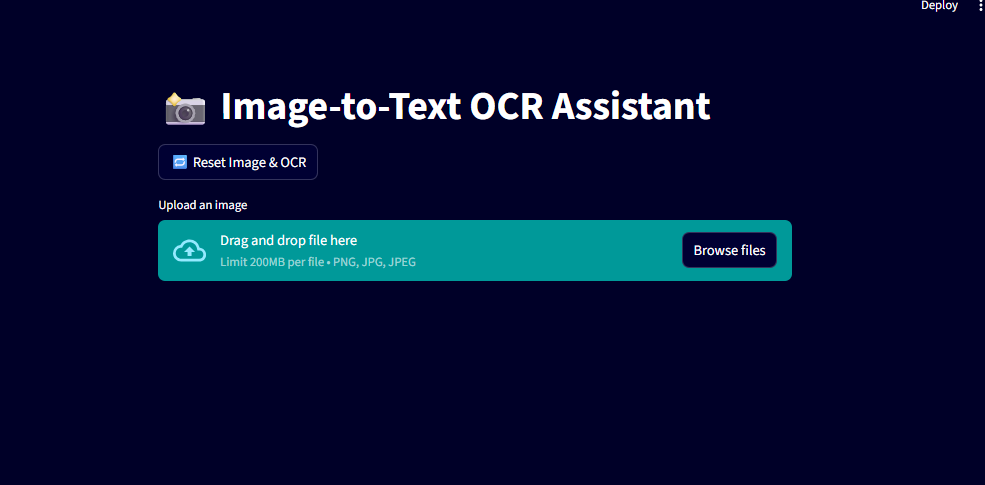
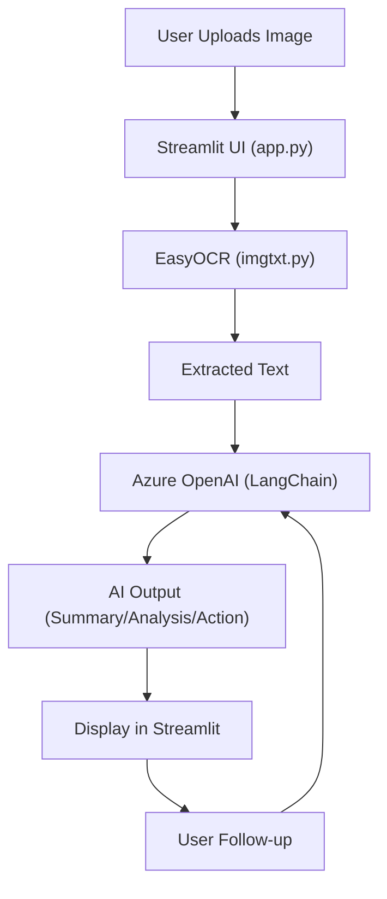
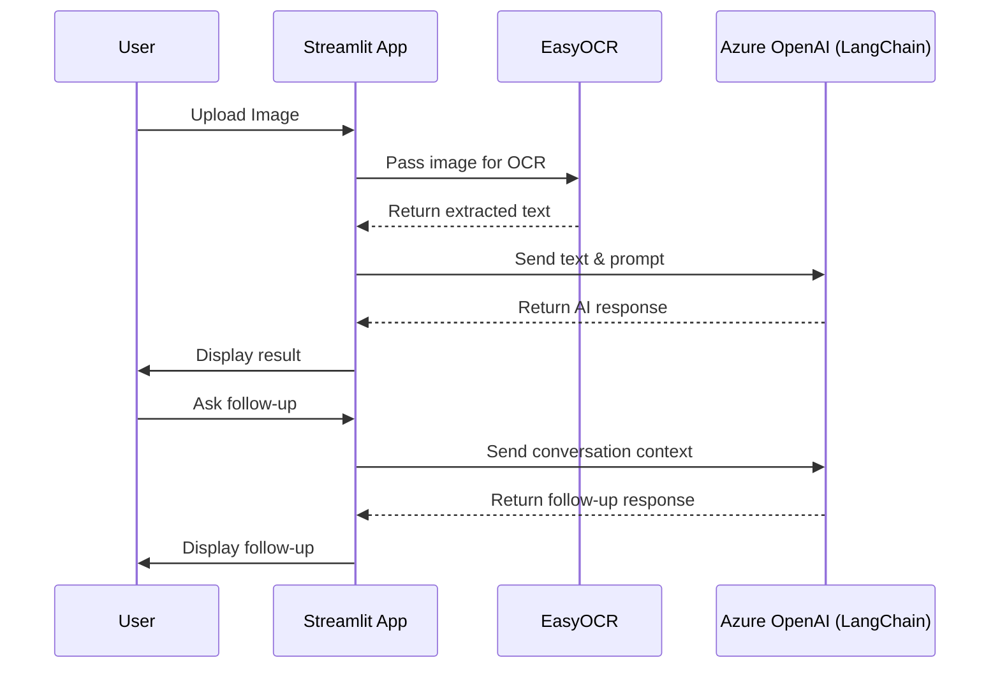

## 🖼️ Image-to-Text OCR Assistant

This project is a Streamlit web app that allows users to upload images, extract text using OCR (EasyOCR), and interact with the extracted text using Azure OpenAI (via LangChain). The app can summarize, analyze, or suggest actions based on the text, and supports conversational follow-ups.

### 📸 Application


---

### 🚀 Features
- Upload images (PNG, JPG, JPEG)
- Extract text from images using EasyOCR
- Summarize, analyze, or suggest actions on the extracted text with Azure OpenAI
- Freeform prompt support for custom AI queries
- Conversation history and follow-up questions

---

### 🛠️ Installation & Setup
1. **Clone the repository**
2. **Install dependencies:**
	```bash
	pip install -r requirements.txt
	```
3. **Set environment variables:**
	- `AZURE_DEPLOYMENT`, `OPENAI_API_VERSION`, `AZURE_OPENAI_KEY`, `AZURE_ENDPOINT`
	- (Optional) `LANGUAGE` for OCR
4. **Run the app:**
	```bash
	streamlit run app.py
	```

---

### 🏗️ Architecture Diagram (Mermaid)


---

### 🔄 Sequence Flow Diagram (Mermaid)


---

### 📝 Example Usage
1. Upload an image containing text.
2. Wait for OCR to extract the text.
3. Choose an action (Summarize, Analyze, Suggest Action, or Freeform Prompt).
4. View the AI's response and ask follow-up questions as needed.
